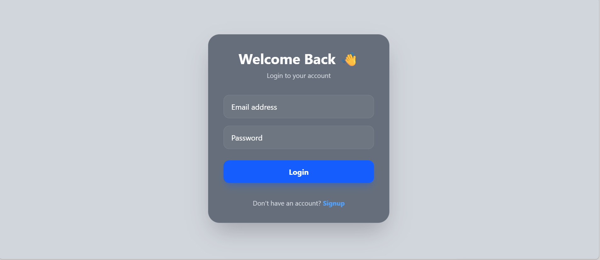
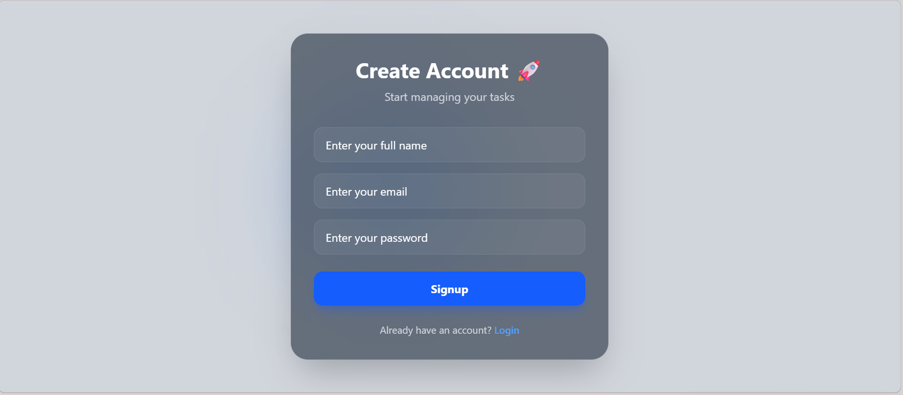
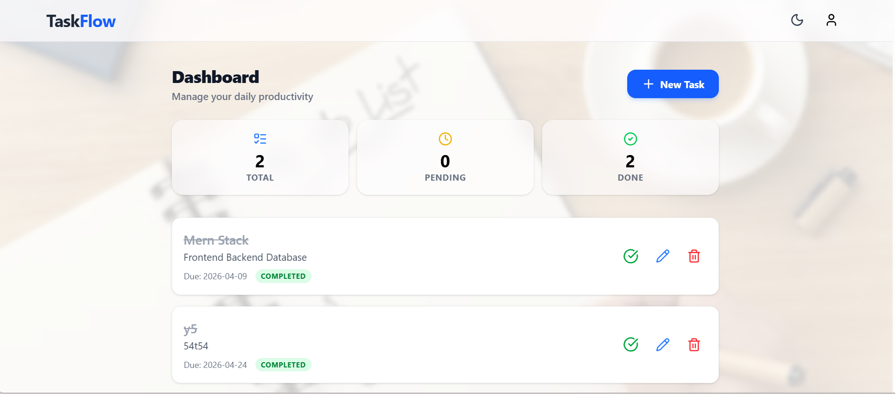
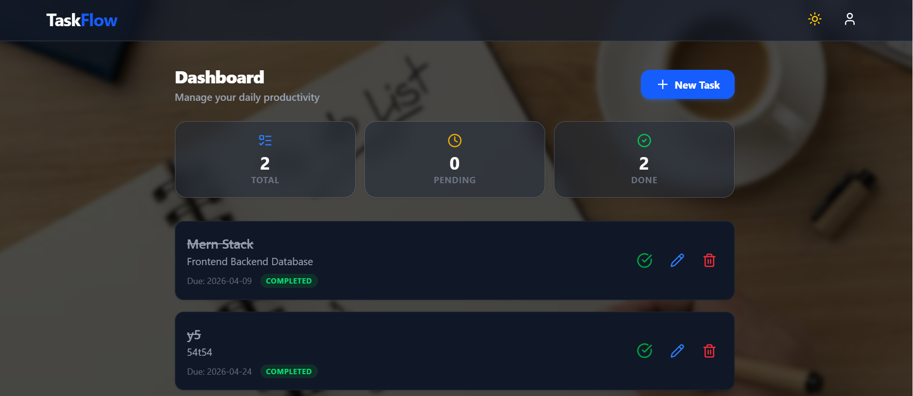
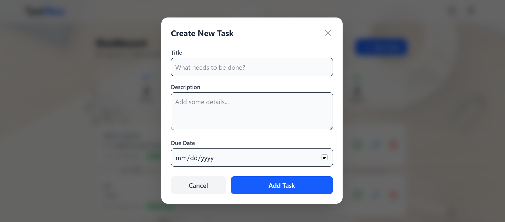
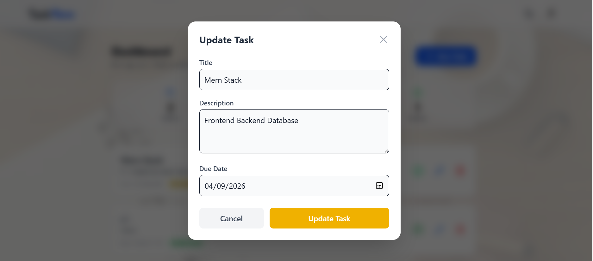
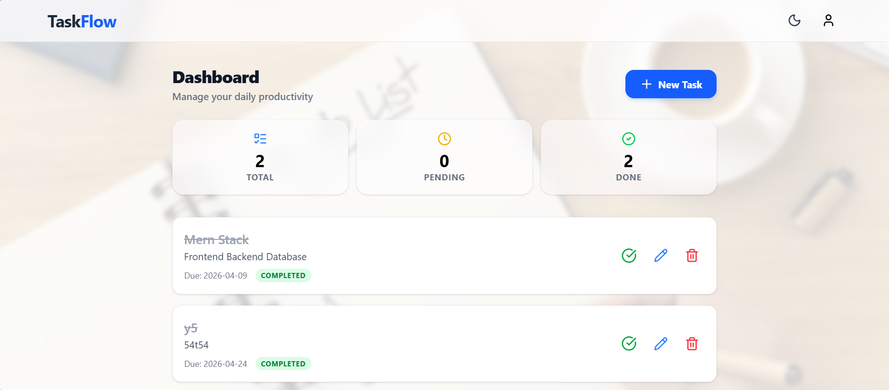

# 📝 Todo App (MERN Stack)

---

# 🚀 Project Overview

A full-stack **Todo Application** built using the **MERN Stack** with authentication, task management, dark mode, animations, and a modern UI.

---

# ✨ Features

## 🔐 Authentication

- Signup & Login
- JWT Authentication (Access + Refresh Token)
- HTTP-only Cookies (Secure)
- Auto Token Refresh
- Protected Routes

## ✅ Task Management

- Add Task
- Edit Task
- Delete Task
- Mark as Completed / Pending

## 🎨 UI & UX

- Fully Responsive (Mobile + Desktop)
- Dark / Light Mode 🌙☀️
- Smooth Animations & Transitions
- Toast Notifications
- Clean Modern Design

---

# 📸 Screenshots

## 🔐 Authentication

<p align="center">
  
  
</p>

---

## 🌞 Light Mode

<p align="center">
  
</p>

---

## 🌙 Dark Mode

<p align="center">
  
</p>

---

## ➕ Add Task

<p align="center">
  
</p>

---

## ✏️ Edit Task

<p align="center">
  
</p>

---

## ✅ Completed Task

<p align="center">
  
</p>

---

# 🛠️ Tech Stack

### Frontend

- React.js (Vite)
- Tailwind CSS v4
- React Router
- Context API
- Axios

### Backend

- Node.js
- Express.js
- MongoDB (Mongoose)
- JWT Authentication

---

# 📁 Folder Structure

````bash
📦 SWAPNIL_TASK
 ┣ 📂 Backend
 ┃ ┣ 📂 config
 ┃ ┣ 📂 controllers
 ┃ ┣ 📂 middleware
 ┃ ┣ 📂 models
 ┃ ┣ 📂 routes
 ┃ ┣ 📂 utils
 ┃ ┣ 🔐 .env
 ┃ ┗ 🚀 server.js
 ┣ 📂 Frontend
 ┃ ┣ 📂 src
 ┃ ┃ ┣ 📂 api
 ┃ ┃ ┣ 📂 components
 ┃ ┃ ┣ 📂 context
 ┃ ┃ ┣ 📂 pages
 ┃ ┃ ┣ ⚛️ App.jsx
 ┃ ┃ ┣ ⚛️ main.jsx
 ┃ ┃ ┗ 🎨 index.css
 ┃ ┣ 🔐 .env
 ┃ ┗ ⚡ vite.config.js
 ┣ 🖼️ screenshots
 ┣ 📄 README.md
 ┗ 🚫 .gitignore

---

# ⚙️ Environment Variables

## 🔐 Backend (.env)

```env
PORT=5000
MONGO_URI=your_mongodb_url

JWT_ACCESS_SECRET=your_access_secret
JWT_REFRESH_SECRET=your_refresh_secret

CLIENT_URL=http://localhost:5173
NODE_ENV=development
````

---

## 🌐 Frontend (.env)

```env
VITE_API_URL=http://localhost:5000/api
```

---

# ▶️ Run Locally

## 1. Clone Repository

```bash
git clone https://github.com/your-username/your-repo.git
cd your-repo
```

---

## 2. Backend Setup

```bash
cd Backend
npm install
npm run dev
```

---

## 3. Frontend Setup

```bash
cd Frontend
npm install
npm run dev
```

---

# 🔄 API Endpoints

## Auth

- POST `/api/auth/signup`
- POST `/api/auth/login`
- POST `/api/auth/logout`
- POST `/api/auth/refresh`
- GET `/api/auth/me`

## Tasks

- GET `/api/tasks`
- POST `/api/tasks`
- PUT `/api/tasks/:id`
- DELETE `/api/tasks/:id`

---

# 🔐 Authentication Flow

1. User logs in → Tokens generated
2. Tokens stored in HTTP-only cookies
3. Access token expires → Refresh token generates new one
4. Seamless user experience

---

# 🌙 Dark Mode

- Implemented using Tailwind v4 custom variant
- Toggle button in Navbar
- Saved in localStorage

---

# 👨‍💻 Author

**Kundan Yadav**

---

# ⭐ Final Notes

- `.env` files are not pushed for security
- Add your own credentials before running
- Production-ready MERN application

---

⭐ If you like this project, give it a star!
